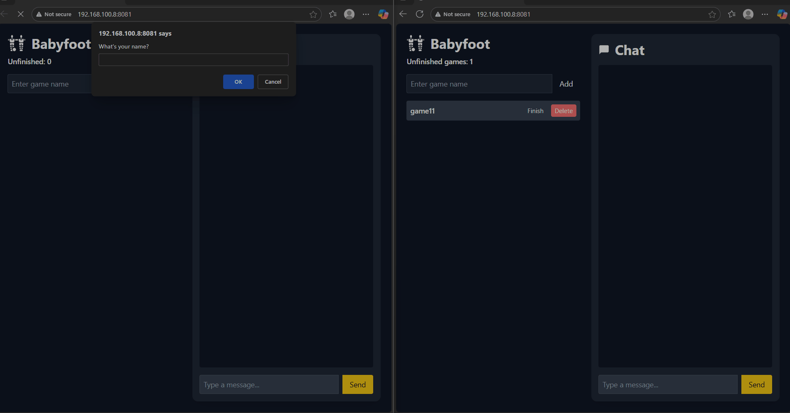
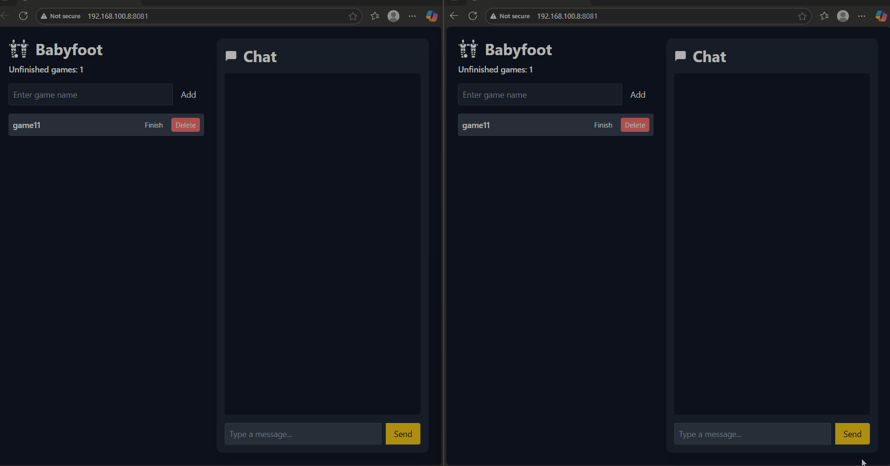
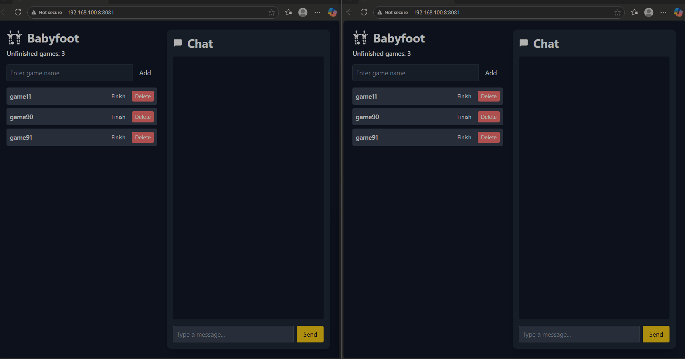
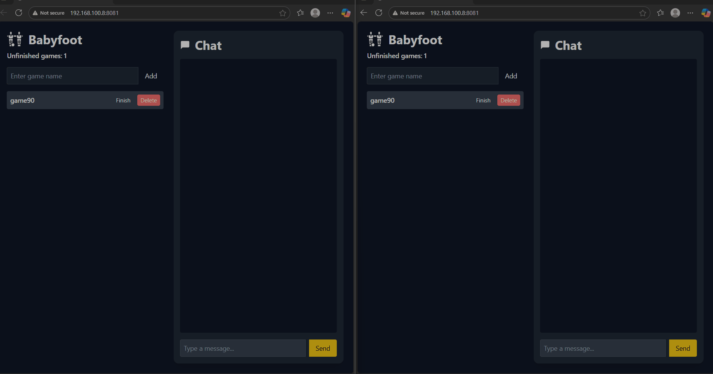

# Babyfoot Project

## Overview
This is a RIA web application for managing Babyfoot games, featuring a frontend, backend, and a WebSocket server for live interactions. The project includes real-time game management and live chat, and a REST API.


## Features
- Add your name and create a game.
- Live game updates using WebSocket.
- Chat functionality (bonus feature).
- REST API for mobile or external integrations (bonus feature).


## How to Run

### Database setup 

Create a database in postgreSQL and call it babyfoot. 
Run this SQL script to create all necessary tables.
    ```bash
    
         -- CREATE TABLE "User" (
            id SERIAL PRIMARY KEY,
            username VARCHAR(50) NOT NULL,
         );
        
        -- Create the Game table
        CREATE TABLE "Game" (
            id SERIAL PRIMARY KEY,
            name VARCHAR(50) NOT NULL,
            state VARCHAR(50) ,
            userid INT REFERENCES "User"(id) ON DELETE CASCADE
        );
        
        -- Create additional tables if needed (example: Chat messages)
        CREATE TABLE "Message" (
            id SERIAL PRIMARY KEY,
            senderid INT REFERENCES "User"(id) ON DELETE CASCADE,
            content TEXT NOT NULL,
        );

### You will need **3 terminals** to run the project.

1. **Frontend**
   ```bash
   # Navigate to frontend folder
   cd frontend
   # Start HTTP server
   http-server

2. **Backend**
   ```bash
    # Navigate to backend folder
    cd backend
    # Run Node.js server
    node index.js

3. **Websocket server**
   ```bash
    # Navigate to backend folder 
    cd backend
    # Run WebSocket server
    node websocket-server.js


## Demo

### User adds their name


### User adds a game


### User deletes a game


### User sends a message



